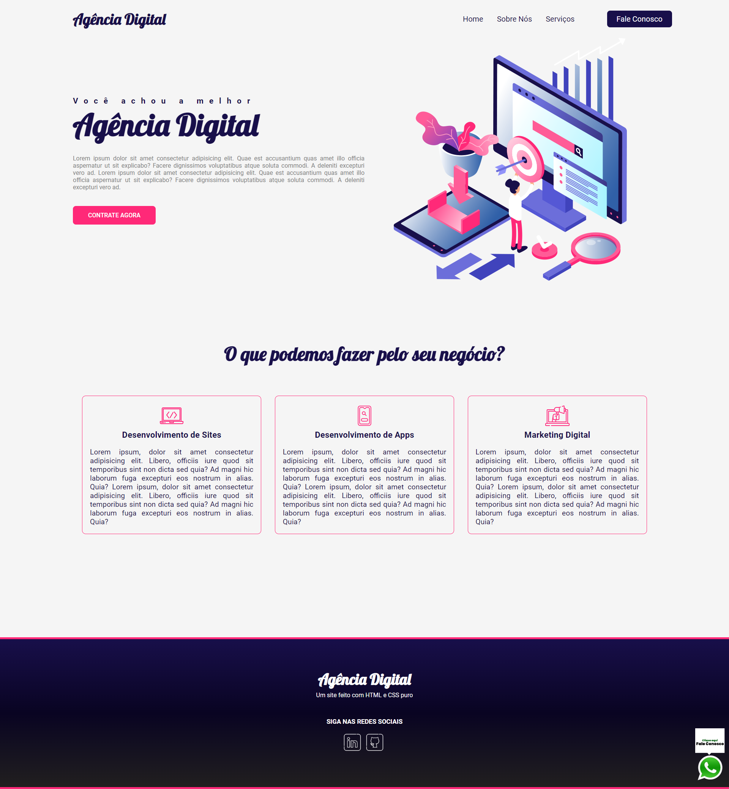

# Agência Digital

## Visão Geral

### Projeto de um Website de uma Agência Digital fictícia.
#

⏳ Projeto realizado em 3 dias.
#
## Construido com:
- HTML
- CSS
  - Flexbox

## Funcionalidades
- Website de apresentação dos serviços de uma Agência Digital fictícia.

## O que eu aprendi:
- Layout desktop first
- Flexbox
- Layout responsivo para dispositivos moveis.

## Link

Veja o projeto aqui: [Acessar🌍](https://devhiderlan.github.io/agencia-digital/) 

## Autor

Hiderlan Santana: [Linkedin](https://www.linkedin.com/in/hiderlan-santana/)